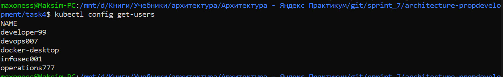
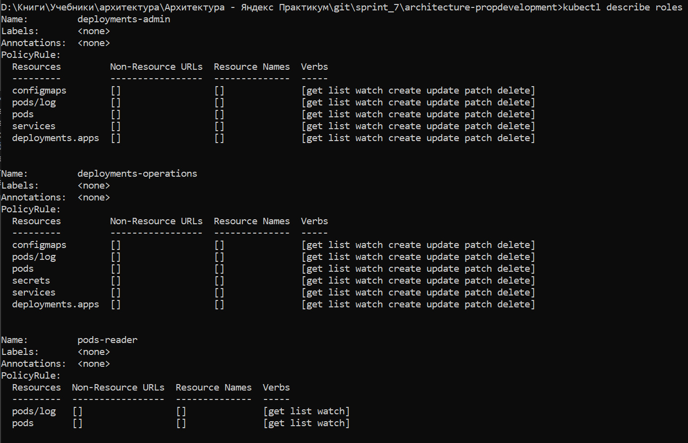
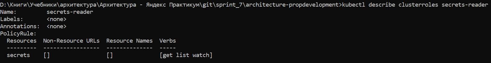
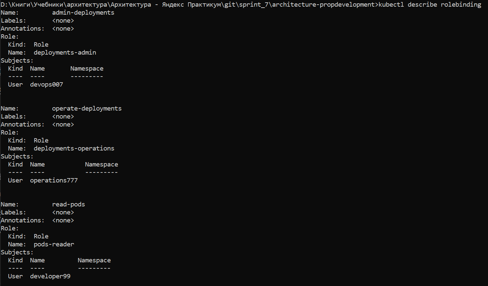
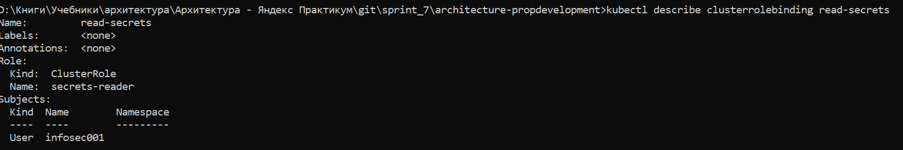

# Task 1
## Проанализируйте диаграмму и описание системы PropDevelopment
### Публичные данные
* данные про объекты недвижимости на сайте-витрине
* данные для виртуальных туров на сайте-витрине
### Внутренние данные
* данные для аналитической отчетности
* данные о работе систем, инструкции, обучающиее материалы
### Конфиденциальные данные
* данные о клиентах
* данные о сделках с клиентами
* данные о собственниках
* данные о сотрудниках
* регистрационные данные об объектах недвижимости
* данные финансовых операций и бухгалтерского учета
### Секретные данные
* данные для аутентификации (клиентов, собственников, сотрудников)
* платежные данные клиентов
* настройки внутренней инфраструктуры и политик безопасности

[Mindmap безопасности данных](task1/mindmap.drawio)


# Task 2
см. [здесь](task2/IB.md)
# Task 3
## Диаграмма контекста в модели С4
[Диаграмма контекста в модели С4](task3/PropDevelopment_С4_model_context.drawio)


## Диаграмма контейнеров PropDevelopment

[Диаграмма контейнеров PropDevelopment](task3/PropDevelopment_С4_model_container.drawio)


## Cписок требований, которым должны удовлетворить внешние интеграции
см. [здесь](task3/requirements.md)

# Task 4
## Роли и их полномочия при работе с Kubernetes
см. [здесь](task4/roles.md)

## Cкрипт для создания пользователей
см. [здесь](task4/users.sh)

```shell
bash ./task4/users.sh
```
результат
```shell
kubectl config get-users
```

## Cкрипт для создания ролей
манифест для создания ролей см. [здесь](task4/roles.yaml)

```shell
bash ./task4/roles.sh
```
результат
```shell
kubectl describe roles
```

```shell
kubectl describe clusterroles secrets-reader
```

## Cкрипт для связи ролей с пользователями
манифест для связи ролей с пользователями см. [здесь](task4/rolebinding.yaml)
```shell
bash ./task4/rolebinding.sh
```
результат
```shell
kubectl describe rolebinding
```

```shell
kubectl describe clusterrolebinding read-secrets
```


# Task 5