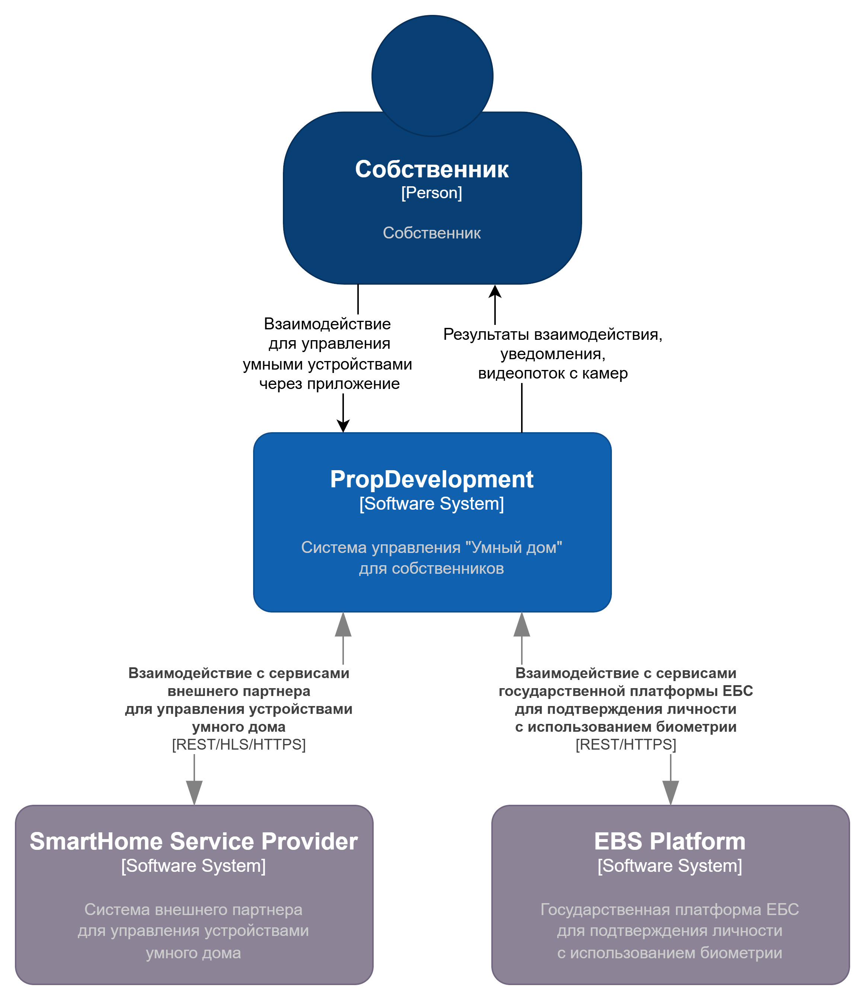

# Task 1
## Проанализируйте диаграмму и описание системы PropDevelopment
### Публичные данные
* данные про объекты недвижимости на сайте-витрине
* данные для виртуальных туров на сайте-витрине
### Внутренние данные
* данные для аналитической отчетности
* данные о работе систем, инструкции, обучающиее материалы
### Конфиденциальные данные
* данные о клиентах
* данные о сделках с клиентами
* данные о собственниках
* данные о сотрудниках
* регистрационные данные об объектах недвижимости
* данные финансовых операций и бухгалтерского учета
### Секретные данные
* данные для аутентификации (клиентов, собственников, сотрудников)
* платежные данные клиентов
* настройки внутренней инфраструктуры и политик безопасности

[Mindmap безопасности данных](task1/mindmap.drawio)

# Task 2
см. [здесь](task2/IB.md)
# Task 3
## Диаграмма контекста в модели С4
[Диаграмма контекста в модели С4](task3/PropDevelopment_С4_model_context.drawio)

## Диаграмма контейнеров PropDevelopment

[Диаграмма контейнеров PropDevelopment](task3/PropDevelopment_С4_model_container.drawio)

## Cписок требований, которым должны удовлетворить внешние интеграции
см. [здесь](task3/requirements.md)